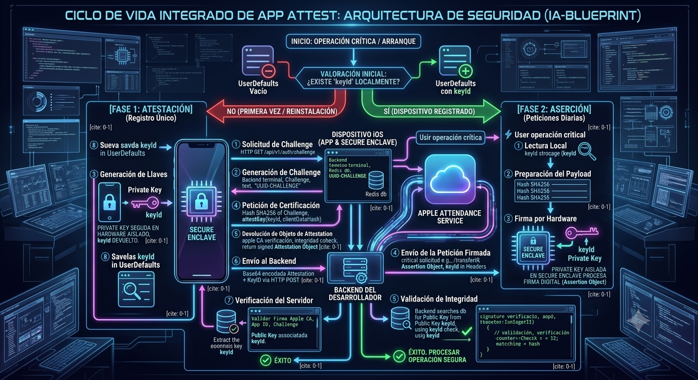
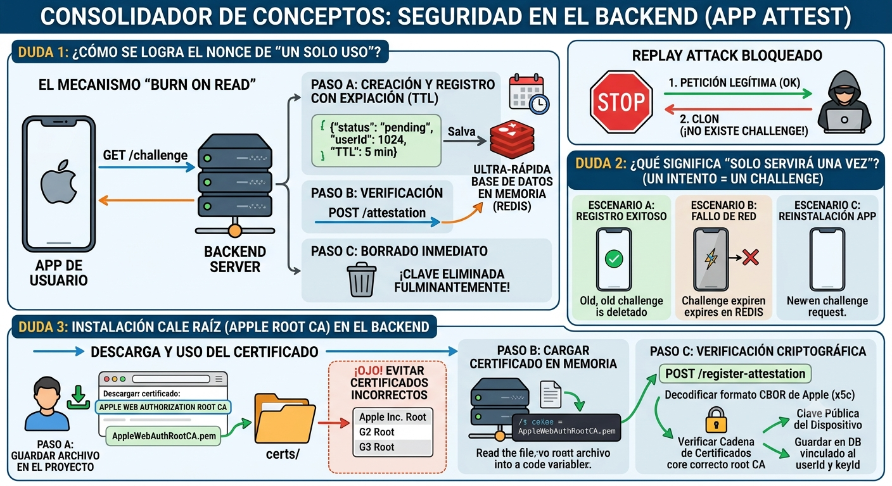

# Manual de Arquitectura Técnica: Apple App Attest & Seguridad Integral Backend

Este documento detalla la implementación extremo a extremo (End-to-End) de **Apple App Attest** dentro del ecosistema de la aplicación. Su objetivo es mitigar ataques de ingeniería inversa, clonación de tráfico, falsificación de dispositivos (*device spoofing*) y ataques de réplica (*replay attacks*).

---
### Requerimientos
- Se requiere una cuenta de Apple Developer activa conectada a Xcode para poder generar los perfiles de aprovisionamiento con soporte para DeviceCheck.

- Dispositivo Físico Obligatorio: DCAppAttestService.shared.isSupported retornará false en simuladores.

## Paso 1: Añadir la Capability en Xcode
Para que el sistema operativo permita a tu App invocar el framework DeviceCheck sin lanzar un error de violación de privacidad, debes declarar la capacidad explícitamente en tu proyecto.

- Abre tu proyecto en Xcode.
- En el navegador de la izquierda, haz clic en la raíz del proyecto (el icono azul con el nombre de tu App).
- Selecciona tu Target principal en la lista.
- Ve a la pestaña Signing & Capabilities (Firmado y Capacidades).
- Haz clic en el botón + Capability (está justo debajo de las pestañas, a la izquierda).
- En el buscador que aparece, escribe App Attest y haz doble clic sobre ella.

### NOTA:
¿Qué cambia en tu código? Al hacer esto, Xcode modificará automáticamente tu archivo .entitlements agregando la clave com.apple.developer.devicecheck.appattest.

### 1. Entitlements
Es obligatorio añadir la capacidad de **App Attest** en la pestaña *Signing & Capabilities* de Xcode. Esto generará la siguiente entrada en el archivo `.entitlements`:

```xml
<key>com.apple.developer.devicecheck.appattest</key>
<dict>
    <key>Environment</key>
    <string>Development</string> </dict>
```

## Paso 2: Configurar el Entorno (Development vs. Production)
Una vez que añades la capacidad, notarás que dentro del archivo .entitlements (o expandiendo la sección de App Attest en la pestaña Signing & Capabilities) aparece una opción llamada Environment.


**Tienes dos opciones y es vital entender cuándo usar cada una**:

**Development (Desarrollo)**
Cuándo usarlo: Mientras estás programando con el iPhone de pruebas conectado por cable a tu Mac, o distribuyendo betas internas a través de TestFlight.

Comportamiento: Apple redirige las solicitudes de atestación a un servidor de pruebas (Sandbox). Las llaves se generan de forma más flexible y no impactan en las métricas de producción de tu cuenta de desarrollador.


**Production (Producción)**
Cuándo usarlo: Únicamente cuando vayas a compilar la versión final que se subirá a la App Store.

Comportamiento: Apunta al servidor real de Apple. Si intentas probar una app configurada en Production directamente compilada desde Xcode en tu casa, el framework arrojará un error de servidor.


## Consideraciones Críticas (Evita estos dolores de cabeza)
1. El Simulador es tu Enemigo en esta API
Si intentas ejecutar el código de App Attest en el simulador de Xcode, la propiedad DCAppAttestService.shared.isSupported devolverá siempre false. No es un error de tu código; es una restricción física. El simulador no posee el chip Secure Enclave ni un identificador de hardware real para comunicarse con los servidores de certificación de Apple. Las pruebas deben hacerse obligatoriamente en un dispositivo físico.

2. Sincronización del Perfil de Desarrollador (El error de tu captura anterior)
Como vimos en los pasos previos, si tu sesión en Xcode expira o se desvincula, Xcode no podrá registrar el nuevo Entitlement en tu cuenta del Apple Developer Portal.

Asegúrate de que en la sección Signing, la casilla Automatically manage signing esté marcada y tu Team (Equipo de desarrollo) esté seleccionado correctamente sin alertas en rojo.

3. El Identificador de la App (AppID) en el Servidor
Cuando configuras App Attest en Xcode, el identificador único que viajará codificado dentro del Attestation Object hacia tu backend será tu AppID.
El AppID es la combinación de dos cosas en tu Apple Portal:
    AppID + Team ID + . + Bundle ID

Nota para el equipo de Backend: Asegúrate de pasarle al desarrollador backend el Team ID (un código alfanumérico de 10 dígitos de tu cuenta de Apple) y el Bundle ID (ejemplo: com.tuempresa.banca), ya que ellos necesitan verificar contractualmente en el Paso 1.7 que la petición viene exactamente de ese paquete firmado por ti y no de una app clonada.




## 🛠️ Paso 0: El Árbol de Decisión Inicial (Control de Ciclo de Vida)

Antes de realizar cualquier llamada a la API o procesar una transacción sensible, la aplicación cliente en iOS debe validar si el hardware físico es compatible y si el dispositivo ya completó el flujo de registro criptográfico en el pasado.

### Descripción
El código cliente realiza una consulta al almacenamiento local persistente (`UserDefaults`). 
* **Ruta Verde:** Si encuentra el identificador de la llave (`keyId`), salta directamente a la **Fase 2 (Aserción)** para firmar las peticiones transaccionales.
* **Ruta Roja:** Si no lo encuentra (debido a una primera ejecución, borrado de datos o reinstalación), inicia obligatoriamente la **Fase 1 (Atestación)**.

```swift
import DeviceCheck

class SecurityRouter {
    private let keyStorageKey = "com.architecture.appattest.keyid"
    
    func verificarEstadoSeguridad() async {
        // 1. Validar si el hardware del iPhone soporta App Attest (Excluye simuladores)
        guard DCAppAttestService.shared.isSupported else {
            print("🚫 Dispositivo no compatible con App Attest (Simulador o iOS obsoleto)")
            return
        }
        
        // 2. Evaluar el árbol de decisión según persistencia local
        if let keyIdExistente = UserDefaults.standard.string(forKey: keyStorageKey) {
            print("🟢 Ruta Verde: Llave encontrada. Proceder a Fase 2 (Aserción).")
            await iniciarFase2Asercion(with: keyIdExistente)
        } else {
            print("🔴 Ruta Roja: No hay llave. Proceder a Fase 1 (Atestación).")
            await iniciarFase1Atestacion()
        }
    }
}
```

### FASE 1: Atestación (Flujo de Registro Único)
Esta fase ocurre una sola vez por instalación de la app. Su propósito es generar un par de claves asimétricas dentro del hardware del iPhone, certificar su legitimidad con los servidores de Apple, y registrar de forma segura la clave pública resultante en el servidor Backend.

## Paso 1.1:** Solicitud de Challenge (App ➡️ Backend)
La app le pide al servidor un valor aleatorio de un solo uso (Nonce o Challenge) para amarrar y evitar ataques de réplica.

```swift
private func solicitarChallengeAlBackend() async throws -> Data {
    let url = URL(string: "https://miapi.com/api/v1/security/challenge")!
    let (data, response) = try await URLSession.shared.data(from: url)
    
    guard (response as? HTTPURLResponse)?.statusCode == 200 else {
        throw NSError(domain: "NetworkError", code: 400)
    }
    
    // El backend devuelve un JSON con el challenge en un string que convertimos a Data
    struct ChallengeResponse: Decodable { let challenge: String }
    let decoded = try JSONDecoder().decode(ChallengeResponse.self, from: data)
    return Data(decoded.challenge.utf8)
}
```


## Paso 1.2:** Generación del Challenge (App ➡️ Backend)
El Backend genera un UUID criptográfico, lo guarda temporalmente en una memoria caché (como Redis) Emplea una estrategia estricta de "Burn on Read" (Borrar al leer) apoyada por un motor de caché de alta velocidad (como Redis). Luego lo envía de regreso a la App en la respuesta HTTP anterior.



**Mecanismo en el Servidor:**
Creación y Registro con TTL: Al recibir el GET /challenge, el backend genera una cadena aleatoria criptográficamente segura (ej. ch_9a8b7c6d5e...). Guarda la clave en Redis con una estructura llave-valor:

Clave: challenge:ch_9a8b7c6d5e...
``` swift
Valor: {"userId": 1024, "status": "pending"}
```

- TTL (Time-To-Live): 5 minutos. Si el cliente no completa la atestación en este lapso, Redis purga el registro de manera automática.

- La Prueba de Fuego (Verificación): Al procesar el registro de atestación, el backend busca la clave en Redis.

El Borrado Inmediato: Si la clave existe, se elimina de forma fulminante de Redis antes de continuar con la lógica criptográfica. Si el registro ya fue borrado o no existe, la petición aborta inmediatamente (HTTP 401).

***¿Por qué esto frena a un atacante?** Si un actor malicioso intercepta el tráfico de red mediante herramientas proxy (como Charles Proxy o Wireshark) y duplica el paquete del POST legítimo para intentar registrar un dispositivo fraudulento dos segundos después, el backend fallará inmediatamente porque el challenge ya habrá sido purgado de Redis en la primera transacción válida.


**📁 Ciclo de Vida Práctico: Un Challenge = Un Intento:**

- Escenario A (Registro Exitoso): La app pide el challenge, firma, el backend valida, destruye el token en Redis y la app guarda el keyId localmente. La Fase 1 no se vuelve a invocar en este dispositivo.

- Escenario B (Corte de red o Error de Apple): Si el flujo se interrumpe, el token expira en Redis a los 5 minutos y queda inservible. Al reintentar, la app está obligada a solicitar un challenge totalmente nuevo.

- Escenario C (Reinstalación de la App): Al reinstalar, UserDefaults se vacía. El dispositivo inicia la Fase 1 forzosamente; el servidor genera un identificador único y fresco. Los tokens históricos ya no existen en ninguna base de datos activa.

## Paso 1.3:** Generación de Llaves (App ➡️ Secure Enclave)
La app le pide al coprocesador físico del iPhone (Secure Enclave) que genere un par de claves asimétricas. La clave privada se queda sellada en el chip; la app solo recibe un string identificador (keyId).

```swift
// Generar la referencia de la llave dentro del Secure Enclave
let keyId = try await DCAppAttestService.shared.generateKey()
```


## Paso 1.4:** Petición de Certificación (App ➡️ Apple Cloud)
La app crea un hash SHA256 del challenge del backend (requisito estricto de Apple) y le pide al framework que envíe la clave pública a los servidores de Apple para certificarla.

```swift
import CryptoKit

// 1. Crear el hash SHA256 obligatorio del reto del servidor
let clientDataHash = Data(SHA256.hash(data: challengeData))

// 2. Solicitar a Apple que certifique nuestra clave pública asociada al keyId
let attestationObject = try await DCAppAttestService.shared.attestKey(keyId, clientDataHash: clientDataHash)
```


## Paso 1.5:** Emisión del Attestation Object (Apple Cloud ➡️ App)
Los servidores de Apple verifican remotamente que el hardware del iPhone no esté manipulado y que el binario de la app sea oficial. Devuelven un paquete binario firmado (Attestation Object) al dispositivo. (Paso de Apple, controlado por el framework).


## Paso 1.6:** Envío del Registro al Servidor (App ➡️ Backend)
La app toma el bloque binario de Apple, lo codifica en Base64 y lo envía junto al keyId mediante un HTTP POST a tu servidor.


```swift
private func registrarEnBackend(attestation: Data, keyId: String) async throws {
    let url = URL(string: "https://miapi.com/api/v1/security/register-attestation")!
    var request = URLRequest(url: url)
    request.httpMethod = "POST"
    request.setValue("application/json", forHTTPHeaderField: "Content-Type")
    
    // Convertir el binario de Apple a String Base64 para transportarlo en el JSON
    let body: [String: String] = [
        "keyId": keyId,
        "attestationObject": attestation.base64EncodedString()
    ]
    request.httpBody = try JSONSerialization.data(withJSONObject: body)
    
    let (_, response) = try await URLSession.shared.data(for: request)
    guard (response as? HTTPURLResponse)?.statusCode == 200 else {
        throw NSError(domain: "ServerError", code: 401)
    }
}
```

## Paso 1.7:** Verificación Criptográfica e "Instalación" de la Raíz de Apple (Backend)
Para validar el Attestation Object, el backend requiere la clave raíz criptográfica de Apple, es decir El backend usa la clave raíz de Apple (Apple Root CA) para validar la firma del paquete enviado, corrobora que el AppID interno coincida con tu Bundle ID y extrae la Clave Pública del usuario para guardarla en la base de datos asociada a ese keyId. (Paso del servidor).

**Aclaración de Arquitectura de Sistemas:**
"Instalar" el certificado raíz de Apple para App Attest no implica alterar configuraciones del sistema operativo (como directorios /etc/ssl/certs en Linux, servidores Nginx/Apache o consolas de AWS). Se trata simplemente de incrustar el archivo de llave pública dentro de la estructura de código fuente o configuración de la aplicación del backend, siendo una práctica totalmente segura para repositorios de código.

1. Selección y Descarga del Certificado Correcto
Dónde obtenerlo: En el portal oficial de Autoridades de Certificación de Apple (Apple PKI): apple.com/certificateauthority.

Filtro Crítico: No se deben emplear las claves generales superiores (Apple Inc. Root, G2 Root, G3 Root), destinadas a actualizaciones de iOS o aprovisionamiento de Xcode. Debe hacerse scroll hacia abajo hasta la sección específica Apple Web Authorization y descargar el archivo Apple Web Authorization Root CA (en formato .pem o .cer). Esto es indispensable porque Apple segrega esta entidad certificadora exclusivamente para verificar interacciones web robustas, Passkeys y atestaciones físicas de hardware de dispositivos en tiempo real.

2. Distribución en el Directorio del Servidor
El archivo descargado se añade a la raíz del código o recursos criptográficos protegidos de la API:

```text 
mi-backend-api/
├── src/
│   ├── controllers/
│   └── services/
├── certs/
│   └── AppleWebAuthRootCA.pem  <-- Ubicación del certificado raíz correcto de Apple
├── package.json
└── server.js
```

3. Implementación y Lógica Criptográfica en el Servidor (Ejemplo Node.js)
El backend lee el archivo una sola vez a nivel de memoria RAM en su inicialización. Posteriormente, decodifica la estructura binaria de Apple (formato CBOR), extrae la cadena de confianza (x5c) que aloja la firma matemática del iPhone y efectúa la validación.

```JavaScript 
const fs = require('fs');
const path = require('path');
const crypto = require('crypto');
const cbor = require('cbor'); // Librería utilitaria para parsear binarios CBOR de Apple

// 1. CARGA EN MEMORIA DEL CERTIFICADO DE APPLE (AL ARRANCAR EL SERVIDOR)
const appleRootCertPath = path.join(__dirname, '../certs/AppleWebAuthRootCA.pem');
const appleRootCert = fs.readFileSync(appleRootCertPath, 'utf8');

// 2. ENDPOINT DE REGISTRO DE ATESTACIÓN (CORRESPONDIENTE AL PASO 1.6 DE IOS)
app.post('/api/v1/security/register-attestation', async (req, res) => {
    try {
        const { keyId, attestationObject } = req.body;
        
        // Convertir la cadena Base64 recibida del cliente iOS a datos binarios (Buffer)
        const attestationBuffer = Buffer.from(attestationObject, 'base64');
        
        // Decodificar la estructura binaria CBOR provista por Apple
        const decodedAttestation = cbor.decodeFirstSync(attestationBuffer);
        
        // Extraer la cadena de certificados x5c provista internamente por el dispositivo
        const certificatesChain = decodedAttestation.attStmt.x5c; 
        
        // [AQUÍ SE EJECUTA EL FILTRO REDIS "BURN ON READ" EXPLICADO EN EL PASO 1.2]
        // (Si el challenge no es válido o ya fue borrado, se eyecta el flujo con HTTP 401)
        
        // 3. VERIFICACIÓN CRIPTOGRÁFICA CONTRA EL ROOT CA DE APPLE
        // El motor criptográfico valida matemáticamente que la cadena x5c se derive
        // de forma directa y legítima de la clave Apple Web Authorization Root CA cargada.
        const esCadenaValida = verificarCadenaDeCertificados(certificatesChain, appleRootCert);
        
        if (!esCadenaValida) {
            return res.status(401).json({ error: "Certificado no emitido por Apple o manipulado" });
        }
        
        // Una vez comprobada la autenticidad, se extrae la Clave Pública del dispositivo físico
        const clavePublicaDispositivo = extraerClavePublica(certificatesChain[0]);
        
        // Se asocia y persiste de forma definitiva en la base de datos transaccional
        await DB.guardarClavePublica(req.user.id, keyId, clavePublicaDispositivo);
        
        res.status(200).send("OK");
        
    } catch (error) {
        res.status(500).json({ error: "Error interno durante la validación criptográfica" });
    }
});
```


## Paso 1.8:** Persistencia Local del Registro (App)
Una vez que el backend responde de manera exitosa (HTTP 200), el cliente iOS consolida localmente la referencia keyId en su almacenamiento interno. De esta forma, se da por concluido el ciclo de registro de hardware y se habilita la vía de autenticación rápida para el futuro.


```swift
// El servidor validó todo con éxito, guardamos el keyId localmente
UserDefaults.standard.set(keyId, forKey: "com.architecture.appattest.keyid")
print("🔒 Fase 1 Finalizada: Dispositivo autenticado y registrado con éxito.")
```


### FASE 2: Aserción (Flujo de Verificación Continua)
Esta fase se ejecuta para el 99% de las interacciones cotidianas del usuario. Se ejecuta de forma transparente en las capas de red antes de despachar payloads sensibles a tu API hacia tus endpoints transaccionales (como transferencias, cambios de credenciales o firmas de contratos).


## Paso 2.1**: Recuperación de la Referencia
Tu gestor de peticiones de red recupera el string del keyId almacenado en UserDefaults para indicarle al hardware qué llave del Secure Enclave debe utilizar para la operación.

```swift
guard let keyId = UserDefaults.standard.string(forKey: "com.architecture.appattest.keyid") else {
    return 
}
```

## Paso 2.2**: Preparación del Payload y Hash Anti-Manipulación
Se toma el JSON exacto con los datos que se van a enviar por internet (el HTTP Body de la transacción) y se le calcula su hash SHA256. Esto blinda la comunicación contra ataques Man-in-the-Middle (MitM), si un proxy malicioso altera los importes o cuentas de destino en tránsito, el hash final calculado por el servidor no coincidirá con el firmado originalmente por el chip del iPhone.

```swift
// Ejemplo práctico de un payload crítico de negocio: una transferencia bancaria
let transaccionBody = ["monto": 750, "cuenta_destino": "987654321"] as [String : Any]
let payloadData = try JSONSerialization.data(withJSONObject: transaccionBody)

// Generar el hash SHA256 estricto del cuerpo de la petición que firmará el hardware
let payloadHash = Data(SHA256.hash(data: payloadData))
```

## Paso 2.3**: Firma por Hardware / Generación de Aserción (App ➡️ Secure Enclave)
La app le pasa el hash del payload y el keyId al Secure Enclave. El chip criptográfico firma digitalmente ese hash usando la clave privada que nunca abandona el hardware físico. generando como salida un objeto estructurado llamado Assertion Object.

```swift
// El Secure Enclave procesa de forma aislada la firma digital por hardware
let assertionObject = try await DCAppAttestService.shared.createAssertion(keyId, clientDataHash: payloadHash)
```

## Paso 2.4**: Envío de Petición con Headers Criptográficos (App ➡️ Backend)
Se construye una petición HTTP normal con el JSON original en el Body, pero inyectas el keyId y el Assertion Object (en Base64) dentro de las cabeceras HTTP de la petición.

```swift
let url = URL(string: "[https://miapi.com/api/v1/banca/transferir](https://miapi.com/api/v1/banca/transferir)")!
var request = URLRequest(url: url)
request.httpMethod = "POST"
request.setValue("application/json", forHTTPHeaderField: "Content-Type")
request.httpBody = payloadData // El JSON original e intacto del Paso 2.2

// Inyectar los metadatos criptográficos de control en las cabeceras HTTP de la petición
request.setValue(keyId, forHTTPHeaderField: "X-AppAttest-KeyID")
request.setValue(assertionObject.base64EncodedString(), forHTTPHeaderField: "X-AppAttest-Assertion")

// Despachar la transacción completamente blindada
let (data, response) = try await URLSession.shared.data(for: request)
```

## Paso 2.5**: Validación de Integridad Total (Backend)
Cuando la API recibe la petición HTTP del cliente, ejecuta una triple verificación secuencial antes de procesar el negocio:

Localización de Credenciales: Toma la cabecera X-AppAttest-KeyID, busca la clave pública previamente registrada en la base de datos para ese usuario y comprueba matemáticamente la firma del X-AppAttest-Assertion.

Control de Integridad del Mensaje: El backend calcula de forma independiente el hash SHA256 del cuerpo JSON recibido en la petición y lo compara con el hash incrustado dentro del objeto de aserción firmado por el iPhone. Si difieren en un solo bit, la petición es rechazada de inmediato.

Control Anti-Clonación (Contador de Apple): El backend extrae un contador numérico incremental gestionado por Apple dentro del objeto de aserción. El servidor comprueba que este valor sea estrictamente superior al número almacenado de la última transacción válida. Si el contador recibido es igual o menor, significa que un atacante capturó tráfico legítimo e intenta inyectar la misma transacción exacta (Replay Attack con payload válido), provocando el bloqueo automático de la llamada.