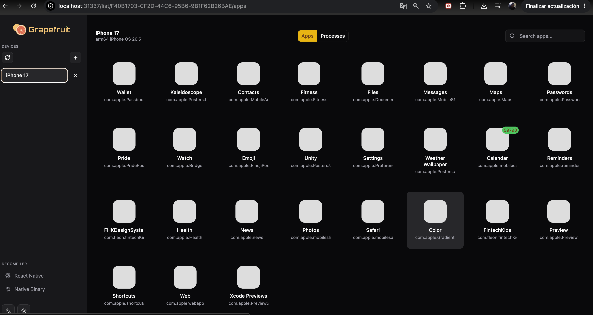

Guía Definitiva: Instalación y Arranque de Grapefruit en macOS (Apple Silicon)
Copia este bloque completo y añádelo directamente a tu manual de Pentesting. Son los pasos reales, limpios y testeados en tu máquina:

🍇 Configuración de Grapefruit (Frida iOS Web UI)
1. Preparación del entorno local (Evitar uso de Sudo)
Para evitar conflictos de permisos con Homebrew y el sistema operativo, configuramos NPM para que instale las herramientas globales directamente en tu carpeta de usuario.


```bash
# Crear la carpeta oculta para los binarios globales de Node
mkdir -p ~/.npm-global

# Indicarle a NPM que use esta ruta a partir de ahora
npm config set prefix '~/.npm-global'

# Añadir permanentemente esta ruta al mapa (PATH) de tu terminal ZSH
echo 'export PATH="$HOME/.npm-global/bin:$PATH"' >> ~/.zshrc

# Recargar la configuración en la pestaña actual
source ~/.zshrc
```

Instalación del paquete oficial
Instalamos el paquete oficial de Grapefruit desde el registro de Node utilizando su identificador real:

```bash
npm install -g igf
```

Flujo de Arranque del Servidor
Dado que las sesiones de la terminal a veces tardan en refrescar los nuevos binarios, el método más rápido y seguro para encender el servidor es invocando su ruta absoluta:

# Arrancar el servidor de Grapefruit de forma directa
```bash
~/.npm-global/bin/igf
```

Acceso a la Interfaz Gráfica
Sin cerrar la terminal donde se está ejecutando el servidor, abre tu navegador web (Safari o Google Chrome) e ingresa a la siguiente URL local:
http://localhost:31337


