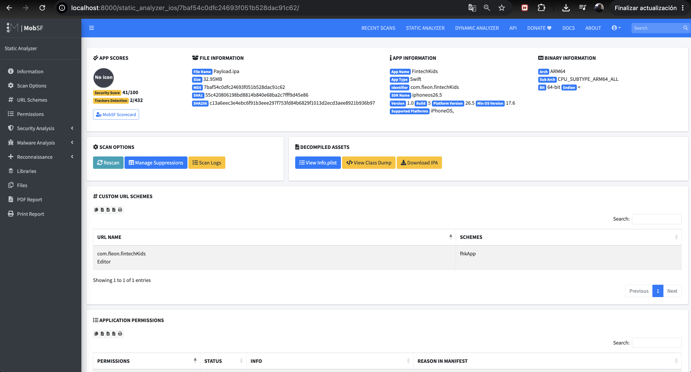

Guía Definitiva: Instalación y Arranque de MobSF en macOS (Apple Silicon)


1. Requisito previo: Levantar Docker
Antes de tocar la terminal, abre la aplicación Docker Desktop en tu Mac. Asegúrate de que el icono de la ballena en la barra superior esté en verde y muestre el estado "Running".

2. Autenticación en Docker Hub
Para evitar bloqueos de descarga (rate limiting) por parte de los servidores de Docker, abre tu terminal y asegúrate de iniciar sesión con tu cuenta:


```bash
docker login
```

(La terminal te mostrará el mensaje Login Succeeded).

3. Descargar la imagen oficial corregida
Ejecuta el comando de descarga utilizando el nombre completo y real del repositorio de MobSF:

```bash
docker pull opensecurity/mobile-security-framework-mobsf:latest
```

(Este paso descargará cerca de 1.5 GB de datos. Espera a que termine y te devuelva el control de la terminal).

4. Lanzar el contenedor del servidor
Para encender el motor de MobSF y mapear los puertos de comunicación, ejecuta el siguiente comando:

```bash
docker run -it --rm -p 8000:8000 opensecurity/mobile-security-framework-mobsf:latest
```

Nota sobre los modificadores usados:

-it: Te permite ver las alertas de escaneo en tiempo real dentro de la terminal.

--rm: Borra el contenedor temporal al apagarlo para que los reportes pesados no llenen el almacenamiento de tu Mac con archivos basura.

-p 8000:8000: Vincula el entorno aislado con el puerto físico de tu máquina.

Sabrás que el servidor está listo cuando las líneas de texto se detengan y veas la confirmación:
[INFO] Gunicorn server up and running on http://0.0.0.0:8000


5. Ejecución en el Navegador
Sin cerrar la ventana de la terminal, abre tu navegador web (Safari o Google Chrome) e ingresa a la siguiente dirección:

```Plaintext
http://localhost:8000
```


Credenciales de Acceso
Dependiendo de la versión interna, la web te solicitará una de estas opciones:

Registro inicial: Te pedirá crear un usuario y contraseña de administrador personalizados en tu primer ingreso.

Credenciales por defecto: Si te aparece directamente la caja de inicio de sesión, los datos de fábrica son:

Usuario: mobsf
Contraseña: mobsf


🛑 Cómo apagar el entorno de forma limpia
Cuando termines de arrastrar tu archivo .ipa y completar las auditorías estáticas, regresa a la terminal donde corre el servidor y presiona:

Plaintext
Ctrl + C


### Pasos para generar IPA desde un ARCHIVE con un .app
Configura el esquema: En Xcode, cambia el destino de compilación (build target) en la parte superior a "Any iOS Device (arm64)".
	
Localiza el archivo: Una vez finalizado, se abrirá la ventana Organizer. Haz clic derecho sobre la entrada reciente y selecciona "Show in Finder".
Accede al contenido: Haz clic derecho sobre el archivo .xcarchive que se resalta y elige "Show Package Contents".
Crea el IPA: * Entra en la carpeta Products > Applications.
* Verás un archivo con extensión .app.
* Crea una carpeta llamada "Payload" (es obligatorio que se llame así). 
* Mueve tu archivo .app dentro de la carpeta Payload.
* Comprime la carpeta Payload en formato .zip.
* Cambia la extensión del archivo resultante de .zip a .ipa.

